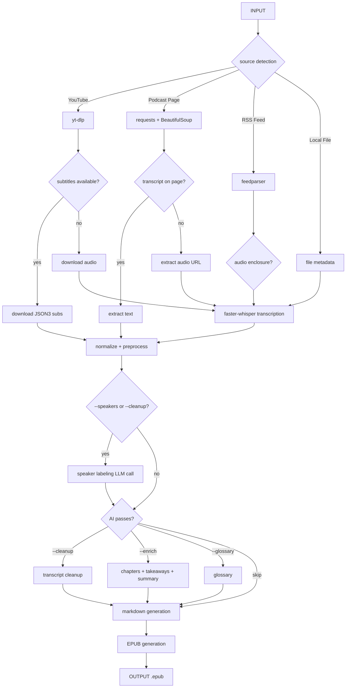

# PodBook — Podcast to Ebook Pipeline

Convert podcasts and videos into readable EPUB ebooks, optimized for Boox e-readers and iPad reading apps.

**Philosophy:** transcript-first, AI-enhanced — not AI-first transcription.

```text
podbook build <url>
```

## Development Environment

| Component | Detail |
|---|---|
| OS | Fedora Linux 44 (x86_64) |
| Python | 3.12+ (developed on 3.14.4) |
| Package manager | uv |
| Transcription | faster-whisper (CTranslate2), base model |
| Local LLM | Ollama — `gemma4:e2b` (Gemma 4B) |
| Cloud LLMs | Claude Haiku 4.5, GPT-4o-mini, DeepSeek |

## Flow



## Install

```bash
uv sync
```

For AI passes, install the provider you want:

```bash
uv sync --extra anthropic   # Claude (recommended — includes prompt caching)
uv sync --extra openai      # OpenAI or DeepSeek
```

## Usage

### Build an ebook

```bash
podbook build https://www.youtube.com/watch?v=jLFG_FZKbks
podbook build https://example.com/podcast/episode
podbook build ./episode.mp3
```

### AI-enhanced build

```bash
# Clean up filler words and add chapters/summary using local Ollama (default)
podbook build --cleanup --enrich <url>

# Label speakers in the transcript (auto-enabled with --cleanup)
podbook build --speakers <url>
podbook build --speakers --cleanup <url>     # speaker labels + cleanup

# When --cleanup is used, a *-raw.md is saved alongside the cleaned *.md
# so you can compare pre- and post-cleanup output.

# Use Claude with prompt caching (fastest for long podcasts)
podbook build --cleanup --enrich --provider claude <url>

# Use OpenAI
podbook build --cleanup --enrich --provider openai --model gpt-4o-mini <url>

# Use DeepSeek (requires DEEPSEEK_API_KEY)
podbook build --cleanup --enrich --provider deepseek <url>

# Add a glossary of key terms
podbook build --enrich --glossary --provider claude <url>

# Override the default model (e.g., for local Ollama)
podbook build --cleanup --enrich --model gemma4:e2b <url>
```

### Estimate costs before running

```bash
podbook build --dry-run --cleanup --enrich <url>
```

### Transcript only

```bash
# Save transcript as JSON (no EPUB)
podbook transcript <url>
podbook transcript <url> --output ./my-transcript.json
```

### EPUB from an existing transcript

```bash
podbook epub ./my-transcript.json
```

### Cache management

```bash
podbook cache list                       # show all cached artifacts
podbook cache list --output-dir ./out    # specify output directory
podbook cache clear                      # clear all cache
podbook cache clear --type audio         # clear only audio files
podbook cache clear --type transcript    # clear only transcript JSONs
```

### Token budget

```bash
# Hard cap on LLM usage — stops AI passes when budget is reached
podbook build --max-tokens 50000 --cleanup --enrich <url>
```

### Force local transcription

```bash
# Skip subtitle check, always transcribe with faster-whisper
podbook build --force-transcribe <url>
```

## Providers

| `--provider` | API key env var | Notes |
|---|---|---|
| `ollama` | — | Local, free. Default. Requires Ollama running. |
| `claude` | `ANTHROPIC_API_KEY` | Prompt caching reduces cost on long podcasts. |
| `openai` | `OPENAI_API_KEY` | GPT-4o-mini default. |
| `deepseek` | `DEEPSEEK_API_KEY` | OpenAI-compatible API, competitive pricing. |

## Dependencies

| Tool | Purpose |
|---|---|
| `yt-dlp` | YouTube audio + subtitle extraction |
| `faster-whisper` | Local transcription fallback (CTranslate2, base model) |
| `ebooklib` | EPUB generation |
| `markdown` | Markdown → HTML conversion for EPUB chapters |
| `typer` | CLI framework |
| `rich` | Terminal output |
| `beautifulsoup4` | Podcast webpage parsing |
| `feedparser` | RSS feed parsing |
| `pydantic` | Immutable data models |

## Project Structure

```text
podbook/
├── cli/main.py              CLI entry point (build, transcript, epub, cache)
├── models.py                Canonical data models (Segment, Transcript, TokenUsage)
├── pipeline.py              End-to-end orchestration
├── sources/
│   ├── youtube.py           YouTube subtitle + audio extraction
│   ├── webpage.py           Podcast page parsing
│   ├── rss.py               RSS feed parsing
│   └── local.py             Local file handling
├── transcript/
│   ├── whisper.py           faster-whisper transcription
│   ├── normalize.py         Segment normalization
│   ├── preprocess.py        Ad/promo/filler classification + filtering
│   └── chunking.py          Sentence-boundary chunking for LLM
├── ai/
│   ├── providers/
│   │   ├── base.py          LLMProvider ABC (cached_prefix interface)
│   │   ├── anthropic.py     Claude with prompt caching
│   │   ├── openai.py        OpenAI + DeepSeek
│   │   └── ollama.py        Local Ollama
│   ├── cleanup.py           Chunked transcript cleanup pass
│   ├── speakers.py          Hybrid LLM + heuristic speaker labeling
│   ├── summarize.py         Chapters, takeaways, summary, glossary
│   └── context.py           Podcast metadata → LLM context builder
└── ebook/
    ├── markdown.py          Markdown generation from transcript + enrichments
    └── epub.py              EPUB generation via ebooklib
tests/
├── test_normalize.py
├── test_preprocess.py
├── test_chunking.py
├── test_markdown.py
└── test_epub.py
```

## Running tests

```bash
uv sync --extra dev
uv run pytest
```
