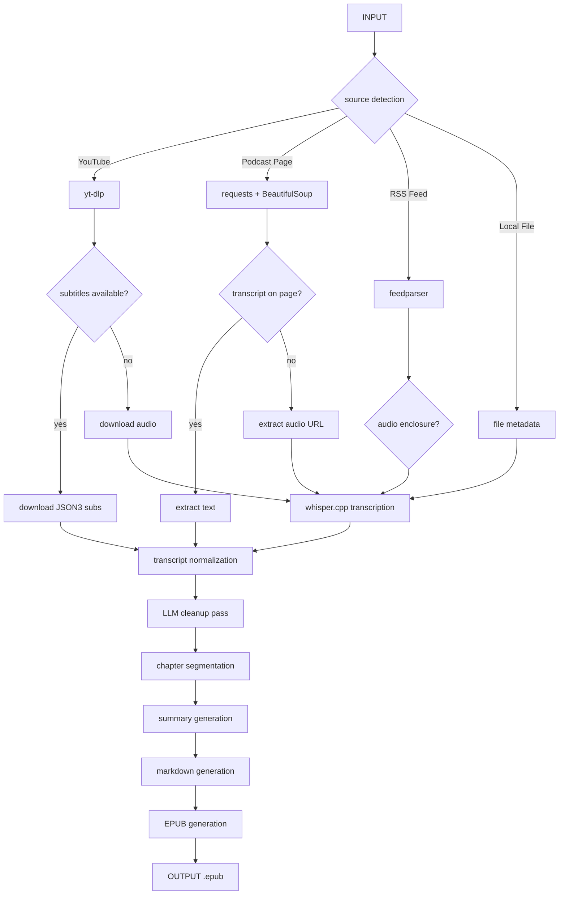

# PodBook — Podcast to Ebook Pipeline

Convert podcasts and videos into readable EPUB ebooks, optimized for Boox e-readers and iPad reading apps.

**Philosophy:** transcript-first, AI-enhanced — not AI-first transcription.

```text
podbook build <url>
```

## Flow



## Install

```bash
uv sync
```

## Usage

### Build an ebook

```bash
podbook build https://www.youtube.com/watch?v=jLFG_FZKbks
podbook build https://example.com/podcast/episode
podbook build ./episode.mp3
```

### Build with token budget

```bash
podbook build --max-tokens 50000 <url>
```

### Estimate costs without LLM calls

```bash
podbook build --dry-run <url>
```

### Force local transcription (skip subtitles)

```bash
podbook build --force-transcribe <url>
```

### Transcript only

```bash
podbook transcript <url>
```

### EPUB from existing transcript

```bash
podbook epub transcript.md
```

## Dependencies

| Tool | Purpose |
|---|---|
| `yt-dlp` | YouTube audio + subtitle extraction |
| `whisper.cpp` | Local transcription fallback |
| `ebooklib` | EPUB generation with full CSS control |
| `typer` | CLI framework |
| `rich` | Terminal output |
| `beautifulsoup4` | Podcast webpage parsing |
| `feedparser` | RSS feed parsing |
| `pydantic` | Data models |

## Project Structure

```text
podbook/
├── cli/main.py            CLI entry point
├── models.py              Canonical data models
├── pipeline.py            End-to-end orchestration
├── sources/
│   ├── youtube.py         YouTube subtitle + audio extraction
│   ├── webpage.py         Podcast page parsing
│   ├── rss.py             RSS feed parsing
│   └── local.py           Local file handling
├── transcript/
│   ├── subtitles.py       SRT/VTT parser
│   ├── whisper.py         whisper.cpp transcription
│   ├── normalize.py       Segment normalization
│   └── chunking.py        Sentence-boundary chunking for LLM
├── ai/
│   ├── providers/base.py  LLM provider ABC
│   ├── providers/openai.py
│   └── providers/ollama.py
├── ebook/
│   ├── markdown.py        Markdown generation
│   └── epub.py            EPUB generation
├── cache/
└── outputs/
```
