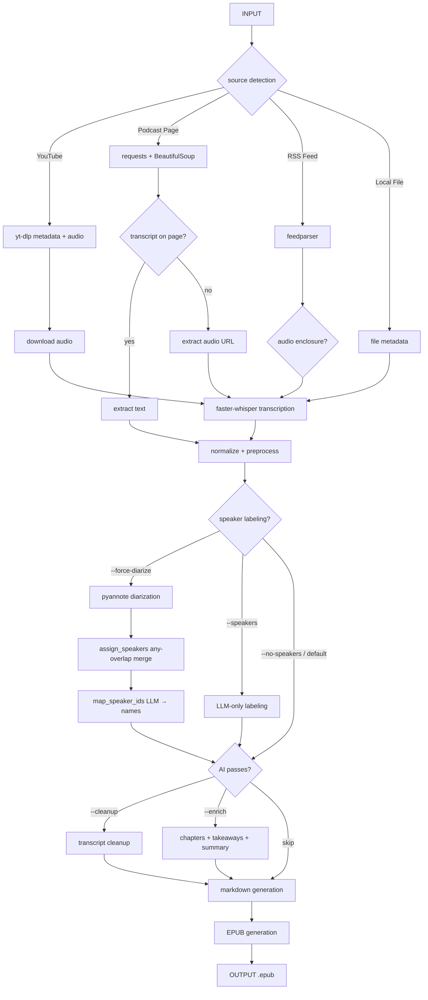

# PodBook — Podcast to Ebook Pipeline

Convert podcasts and videos into readable EPUB ebooks, optimized for Boox e-readers and iPad reading apps.

**Philosophy:** whisper-first, AI-enhanced — local transcription preferred over subtitles for consistent quality.

```text
podbook build <url>
```

## Development Environment

| Component | Detail |
|---|---|
| OS | Fedora Linux 44 (x86_64) · macOS (Apple Silicon) |
| Python | 3.12+ (developed on 3.14.x) |
| Package manager | uv |
| Transcription | faster-whisper (CTranslate2), base model |
| Local LLM | Ollama — `gemma4:e2b` (7.2 GB); requires `--model gemma4:e2b` flag |
| Cloud LLMs | Claude Haiku 4.5, GPT-4o-mini, DeepSeek |
| System deps | `ffmpeg` — required for audio download/transcription fallback |

## Flow



## Install

```bash
uv sync
uv sync --extra anthropic   # Claude (recommended — includes prompt caching)
uv sync --extra openai      # OpenAI or DeepSeek
uv sync --extra diarize     # pyannote.audio speaker diarization (--force-diarize)
uv sync --extra dev         # adds pytest
```

**System dependencies** (required for audio download/transcription fallback):

```bash
# macOS
brew install ffmpeg ollama

# Fedora
sudo dnf install ffmpeg
```

**Ollama model** (if using local LLM):

```bash
ollama pull gemma4:e2b
```

## Usage

### Build an ebook

```bash
podbook build https://www.youtube.com/watch?v=jLFG_FZKbks
podbook build https://example.com/podcast/episode
podbook build ./episode.mp3
```

### AI-enhanced build

```bash
# Clean up filler words and add chapters/summary (Ollama, default provider)
# Ollama defaults to llama3.2 — override with --model for your local model
podbook build --cleanup --enrich --provider ollama --model gemma4:e2b <url>

# Label speakers in the transcript (opt-in)
podbook build --speakers <url>
podbook build --speakers --cleanup --provider ollama --model gemma4:e2b <url>

# Speaker labeling is opt-in — --cleanup no longer auto-enables it
podbook build --cleanup <url>  # runs cleanup without speaker labeling

# When --cleanup is used, a *-raw.md is saved alongside the cleaned *.md
# so you can compare pre- and post-cleanup output.

# Use Claude with prompt caching (fastest for long podcasts)
podbook build --cleanup --enrich --provider claude <url>

# Use OpenAI
podbook build --cleanup --enrich --provider openai --model gpt-4o-mini <url>

# Use DeepSeek (requires DEEPSEEK_API_KEY and optionally DEEPSEEK_MODEL in .env)
podbook build --cleanup --enrich --provider deepseek <url>

# Add a glossary of key terms
podbook build --enrich --glossary --provider claude <url>
```

### Configuration

API keys are loaded automatically from `.env`. Copy `.env.example` or create your own:

```bash
DEEPSEEK_API_KEY=sk-...
DEEPSEEK_MODEL=deepseek-v4-flash    # optional, defaults to deepseek-chat
ANTHROPIC_API_KEY=sk-ant-...        # for --provider claude
OPENAI_API_KEY=sk-...               # for --provider openai
```

Output filenames include the provider for differentiation across runs: `title-deepseek.md`, `title-claude.md`, etc.

### Estimate costs before running

```bash
podbook build --dry-run --cleanup --enrich <url>
```

### Transcript only

```bash
# Save transcript as JSON (no EPUB)
podbook transcript <url>
podbook transcript <url> --output ./my-transcript.json
```

### EPUB from an existing transcript

```bash
podbook epub ./my-transcript.json
```

### Cache management

```bash
podbook cache list                       # show all cached artifacts
podbook cache list --output-dir ./out    # specify output directory
podbook cache clear                      # clear all cache
podbook cache clear --type audio         # clear only audio files
podbook cache clear --type transcript    # clear only transcript JSONs
```

### Token budget

```bash
# Hard cap on LLM usage — stops AI passes when budget is reached
podbook build --max-tokens 50000 --cleanup --enrich <url>
```

### Force local transcription

```bash
# Skip cached transcript, always re-download audio + re-transcribe with faster-whisper
podbook build --force-transcribe <url>
```

### Speaker diarization (acoustic)

```bash
# Use pyannote.audio for acoustic speaker diarization instead of LLM-only labeling
podbook build --force-diarize --cleanup --enrich <url>
```

Requires `uv sync --extra diarize` and `HUGGINGFACE_TOKEN` or `HF_TOKEN` in `.env` with access to gated repos.

## Speaker Diarization

Two speaker labeling paths exist, controlled by `--force-diarize`:

| Path | Trigger | Method | Quality |
|---|---|---|---|
| LLM-only | `--speakers` | One LLM call on utterance sample + heuristic propagation | Good — works on text alone |
| Acoustic | `--force-diarize` | pyannote.audio + any-overlap merge + LLM name mapping | Better on clean audio, noisy on short interjections |

### Diarization → transcript merge strategy

When `--force-diarize` is used, pyannote produces `(start, end, SPEAKER_XX)` windows. These are merged into whisper segments via `assign_speakers()` in `diarize.py`:

1. **Group** diarization windows by speaker ID
2. For each whisper segment, check for **any time overlap** with each speaker independently
3. **Single match** → tag with that speaker ID
4. **Multiple matches** → combined label (e.g. `SPEAKER_00_SPEAKER_01`)
5. **No match** → fallback to the longest-duration speaker

This **any-overlap** approach replaces the previous max-overlap strategy. Max-overlap always selected the dominant speaker because pyannote produces finer-grained windows (as short as 0.01s) than whisper segments (~1-3s). The any-overlap approach preserves short interjections from secondary speakers by acknowledging when a segment overlaps both speakers.

Combined labels are later resolved through the LLM name mapper (`map_speaker_ids` in `speakers.py`):
- `SPEAKER_00` → `Joe Rogan`
- `SPEAKER_01` → `Theo Von`
- `SPEAKER_00_SPEAKER_01` → `Joe_Rogan_Theo_Von`

### Potential enhancements

- **Whisper segmentation at diarization boundaries**: Split whisper segments at diarization window boundaries for cleaner speaker attribution instead of combined labels.
- **Voice-activity-based segmentation**: Use VAD to produce whisper segments that align with speaker turns, avoiding the granularity mismatch.
- **Embedding-based speaker clustering**: Use d-vector embeddings from pyannote to cluster whisper segments by speaker similarity, sidestepping time-alignment entirely.
- **Streaming diarization**: Process audio in chunks for real-time/low-latency workflows.
- **Speaker-conditional cleanup**: Route segments to separate LLM cleanup calls per speaker for consistent voice/style.

## Providers

| `--provider` | API key env var | Notes |
|---|---|---|
| `ollama` | — | Local, free. Default. Requires Ollama running. Use `--model` to select your pulled model (e.g. `--model gemma4:e2b`). |
| `claude` | `ANTHROPIC_API_KEY` | Prompt caching reduces cost on long podcasts. |
| `openai` | `OPENAI_API_KEY` | GPT-4o-mini default. |
| `deepseek` | `DEEPSEEK_API_KEY` | OpenAI-compatible API. Model from `DEEPSEEK_MODEL` in `.env`. |

## Dependencies

| Tool | Purpose |
|---|---|
| `yt-dlp` | YouTube audio + subtitle extraction (VTT format with rolling-caption deduplication) |
| `faster-whisper` | Local transcription (CTranslate2, base model) |
| `pyannote.audio` | Acoustic speaker diarization (optional, via `--force-diarize`) |
| `ffmpeg` | Audio conversion for transcription fallback (system dep, not pip) |
| `ebooklib` | EPUB generation |
| `markdown` | Markdown → HTML conversion for EPUB chapters |
| `typer` | CLI framework |
| `rich` | Terminal output |
| `beautifulsoup4` | Podcast webpage parsing |
| `feedparser` | RSS feed parsing |
| `pydantic` | Immutable data models |
| `python-dotenv` | Auto-load API keys from `.env` file |

## Project Structure

```text
podbook/
├── cli/main.py              CLI entry point (build, transcript, epub, cache)
├── models.py                Canonical data models (Segment, Transcript, TokenUsage)
├── pipeline.py              End-to-end orchestration
├── logging.py               Structured logging (runs.jsonl + llm_calls.jsonl)
├── sources/
│   ├── youtube.py           YouTube subtitle + audio extraction
│   ├── webpage.py           Podcast page parsing
│   ├── rss.py               RSS feed parsing
│   └── local.py             Local file handling
├── transcript/
│   ├── whisper.py           faster-whisper transcription
│   ├── normalize.py         Segment normalization
│   ├── preprocess.py        Ad/promo/filler classification + filtering
│   ├── chunking.py          Sentence-boundary chunking for LLM
│   └── diarize.py           pyannote speaker diarization + any-overlap merge
├── ai/
│   ├── providers/
│   │   ├── base.py          LLMProvider ABC (cached_prefix interface)
│   │   ├── anthropic.py     Claude with prompt caching
│   │   ├── openai.py        OpenAI + DeepSeek
│   │   └── ollama.py        Local Ollama
│   ├── cleanup.py           Chunked transcript cleanup pass
│   ├── speakers.py          Hybrid LLM + heuristic speaker labeling
│   ├── summarize.py         Chapters, takeaways, summary, glossary
│   └── context.py           Podcast metadata → LLM context builder
└── ebook/
    ├── markdown.py          Markdown generation from transcript + enrichments
    └── epub.py              EPUB generation via ebooklib
tests/
├── test_normalize.py
├── test_preprocess.py
├── test_chunking.py
├── test_markdown.py
└── test_epub.py
```

## Running tests

```bash
uv sync --extra dev
uv run pytest
```
