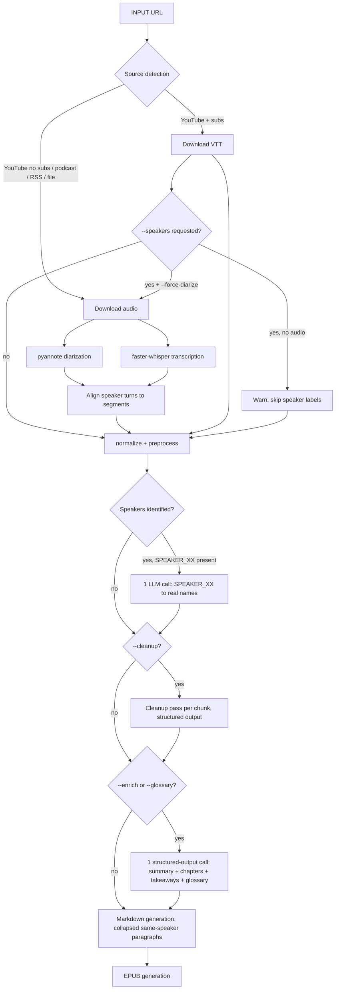

# PodBook Pipeline Improvement Plan

A prioritized plan to address speaker labeling accuracy, sentence fragmentation, and LLM cost — based on the current pipeline and an example output (JRE/Theo Von Epstein clip).

---

## Diagnosis

Three issues observed in the example output:

1. **Every line labeled "Joe Rogan"** despite Theo Von clearly being a co-host. The LLM has no acoustic signal and anchored on the first identified speaker.
2. **Fragmented sentences** — single thoughts broken across multiple `**Joe Rogan:**` blocks, even when content flows continuously.
3. **Multiple LLM passes with overlapping responsibilities** (cleanup vs enrichment), increasing cost and risk of model drift.

Root causes:

- Speaker labeling relies on an LLM reading text. For a two-host podcast with similar vernacular, this is unreliable regardless of model strength.
- The markdown generator re-emits the speaker prefix on every segment instead of on speaker _change_.
- `ai/cleanup.py` and `ai/summarize.py` produce related artifacts (chapters, takeaways, summary, glossary) in separate calls.

---

## Recommendations, Ranked by ROI

### 1. Collapse consecutive same-speaker segments in markdown output

**Effort:** ~10 lines in `ebook/markdown.py`.
**Impact:** Largest readability win for smallest change. Works immediately even before fixing speaker accuracy.

**Current behavior:**

```markdown
**Joe Rogan:** First sentence.

**Joe Rogan:** Second sentence.

**Joe Rogan:** Third sentence.
```

**Target behavior:**

```markdown
**Joe Rogan:** First sentence. Second sentence. Third sentence.

**Theo Von:** Response.

**Joe Rogan:** Follow-up.
```

**Implementation sketch:**

- In the markdown emitter, iterate over segments with a `previous_speaker` variable.
- If `segment.speaker == previous_speaker`, append to the current paragraph with a space separator.
- If different, emit a new `**Speaker:**` paragraph.
- Handle terminal punctuation: if the previous segment doesn't end in `.!?`, add a space; otherwise add space + capitalize if needed.

**Why this matters even if speakers are wrong:** even when every segment is labeled "Joe Rogan," collapsing them into single paragraphs reads as continuous prose instead of stuttering dialogue.

---

### 2. Add `pyannote.audio` diarization to the audio path

**Effort:** Medium. New dependency, new module (`transcript/diarize.py`), integration point in the faster-whisper branch.
**Impact:** Solves speaker labeling correctly whenever audio is available.

**Where it slots in:**

```
yt-dlp audio download → pyannote.audio diarization → (start, end, SPEAKER_XX) tuples
                     → faster-whisper transcription → segments with timestamps
                     → align by timestamp overlap → segments tagged with SPEAKER_XX
                     → 1 LLM call to map SPEAKER_00 → "Joe Rogan", SPEAKER_01 → "Theo Von"
                     → find-and-replace in transcript
```

**Implementation notes:**

- `pyannote/speaker-diarization-3.1` works well, requires HuggingFace token (free).
- Alignment is straightforward: for each whisper segment, assign the speaker whose diarization window has maximum overlap with the segment's `(start, end)`.
- The LLM call for SPEAKER_XX → real name is small: send the longest 2-3 utterances per speaker + podcast title/description, ask for a JSON mapping.
- Cache diarization output alongside transcripts — it's deterministic and the audio doesn't change.

**Cost consideration:** pyannote runs locally on CPU (slow) or GPU (fast). For Boox/iPad batch use, CPU is fine; for interactive, GPU helps.

**Limitations:** doesn't handle crosstalk well (both speakers talking at once produces a single dominant speaker). Generally fine for podcasts.

---

### 3. Decide on a strategy for the VTT/subtitle path

**Context:** When YouTube subtitles are available, the pipeline skips audio download and uses VTT directly. VTT has no speaker info. There are two reasonable options:

**Option A — Skip speaker labels on this path entirely.**
Present the transcript as continuous prose with paragraph breaks inferred from VTT timing gaps (e.g., gap > 1.5s → new paragraph).
_Pro:_ Free, no risk of mislabeling.
_Con:_ Loses dialogue structure for multi-host shows.

**Option B — Always download audio for diarization when speakers are requested.**
If `--speakers` is set, download audio in parallel with VTT and run pyannote, then align speaker turns to VTT segments by timestamp.
_Pro:_ Correct speaker labels.
_Con:_ Defeats some of the speed/cost advantage of the VTT path.

**Recommendation:** make it configurable. Default behavior: if `--speakers` and no diarization possible (VTT-only, no audio), warn and skip labeling. Add `--force-diarize` to opt into audio download.

---

### 4. Verify and improve prompt caching usage

**Anthropic (Claude):** README already mentions prompt caching support — verify the system prompt + podcast metadata + cleaned full transcript are placed in the cacheable prefix, and per-chunk content is the only thing changing.

**DeepSeek:** DeepSeek has automatic input prefix caching (no explicit cache control needed, but the API does report cache hits). Structure messages so the stable prefix (system prompt, podcast context) comes first, and verify cache hits in API responses. If `ai/providers/openai.py` is currently building messages in a way that breaks the prefix (e.g., interpolating chunk-specific data into the system prompt), restructure so the stable parts are first.

**Quick check:** log `prompt_tokens_details.cached_tokens` (OpenAI/DeepSeek) or `cache_read_input_tokens` (Anthropic) per call to confirm caching is actually firing.

---

### 5. Consolidate enrichment into a single structured-output call

**Current:** `ai/summarize.py` produces chapters, takeaways, summary, and (optionally) glossary. If these are separate API calls, they're paying the same input cost (the cleaned transcript) multiple times.

**Target:** one call returning a structured JSON object:

```json
{
  "summary": "...",
  "chapters": [{"title": "...", "start_segment_id": 0}, ...],
  "takeaways": ["...", "..."],
  "glossary": [{"term": "...", "definition": "..."}, ...]
}
```

**Implementation:**

- Single prompt requests all artifacts.
- Use the provider's structured output / JSON mode where available (Claude: tool use, OpenAI/DeepSeek: `response_format: json_schema`, Ollama: format=json).
- Glossary becomes a field in the same response, gated by `--glossary` flag (omit the field instruction from the prompt when not requested).

**Trade-off:** longer single response, but only one prompt-cache-warm call instead of 3-4 cold ones.

---

### 6. Cleanup pass — keep separate, tighten prompt

The cleanup pass operates per-chunk and is structurally different from enrichment. Keep it separate, but:

- Tighten the prompt to be explicit about what NOT to change. Listing forbidden operations works better than positive instructions for most models ("do not paraphrase, do not reorder, do not add commentary, do not merge speakers, do not insert headers").
- Use structured output: `{segment_id: cleaned_text}` mapping rather than free-form text. This makes drift detection trivial (compare segment IDs in vs out) and prevents the model from adding extra prose.
- For shorter chunks (~800-1200 words), local/small models follow "verbatim except X" more reliably. Worth A/B testing chunk size against your current ~3k word chunks.

---

## Proposed Revised Pipeline



Key differences from the current pipeline:

- Diarization happens on the audio path before transcription alignment.
- One small LLM call for speaker name _mapping_, not per-segment labeling.
- Enrichment is a single structured call.
- Markdown generation collapses same-speaker segments.

---

## Implementation Order

A suggested sequencing that ships value incrementally:

1. **Markdown collapse** (`ebook/markdown.py`) — ship today, no dependencies. Solves visible fragmentation immediately.
2. **Cleanup prompt tightening + structured output** — improves quality of existing pass.
3. **Enrichment consolidation** — cost win.
4. **Prompt caching audit** — verify, fix message structure if needed.
5. **pyannote integration** — the bigger architectural change; do this last when you have a clean baseline to compare against.
6. **VTT-path strategy decision** — depends on pyannote being in place.

---

## Open Questions

A few things to decide before implementing:

- **VTT path policy** — silent skip, warn, or force-diarize default?
- **Diarization caching** — store alongside transcripts in the same cache directory, or separate?
- **Speaker mapping confidence** — what to do when the LLM can't confidently map SPEAKER_XX to a real name (e.g., guest podcasts with no published guest list)? Fall back to "Host" / "Guest 1" labels?
- **Chunk size for cleanup** — keep 3k or test smaller? Worth a side-by-side on one episode.

---

## What I'm Not Recommending

A few things considered and rejected:

- **Swapping faster-whisper for WhisperX.** WhisperX bundles diarization + alignment + faster-whisper, but you already have a clean separation of concerns. Adding pyannote as a standalone step is less invasive.
- **Doing speaker labeling purely via LLM with better prompting.** Tried implicitly in the current pipeline — the problem isn't the prompt, it's the lack of acoustic signal. No amount of prompting fixes this for two-host podcasts.
- **Combining cleanup + enrichment into one pass.** They operate at different granularities (per-chunk vs full transcript) and combining them would require either re-running cleanup logic during enrichment or doing enrichment per-chunk, both worse than the current split.
